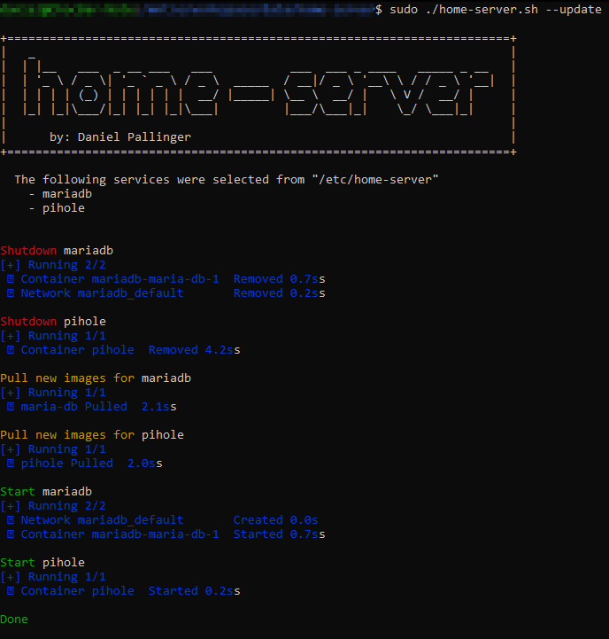

```
 _
| |__   ___  _ __ ___   ___           ___  ___ _ ____   _____ _ __
| '_ \ / _ \| '_ ` _ \ / _ \  _____  / __|/ _ \ '__\ \ / / _ \ '__|
| | | | (_) | | | | | |  __/ |_____| \__ \  __/ |   \ V /  __/ |
|_| |_|\___/|_| |_| |_|\___|         |___/\___|_|    \_/ \___|_|
    by: Daniel Pallinger
```

The purpose of this tool is to make the process of updating docker services
fast and easy. By using this tool you will be able to perform quick manual updates
or automate them by scheduling a cron job that executes the script in its update mode.

**Note:** By default, the script will search for services in the `/etc/home-server/` directory.
However, you can change the default directory by modifying the `BASE_PATH` variable in the script.

### File Structure

In order for the script to work the folder structure for your services must match
the pattern `BASE_PATH/*/docker-compose.yml`. You can chose any directory name
in place of the `*`.

This example illustrates how the file structure has to look like:
```
BASE_PATH
├── service-1
│   └── docker-compose.yml
├── service-2
│   └── docker-compose.yml
└── service-3
    └── docker-compose.yml
```

### Usage

```
NAME
       home-server.sh - Perform operations on services under "/etc/home-server"

OPTIONS
       --startup
          Start all services

       --update
          Update all services, by shutting them down, pulling the latest images
          that are defined in the compose files and restarting them.

       --shutdown
          Shutdown all services, removing containers, networks, volumes.

          By default, the operations are performed on all services. If you want to perform the
          operation only on certain services, then provide a whitespace separated list of services.
          (e.g. --<option> service-1 service-2 ... )
```

### Example Output

