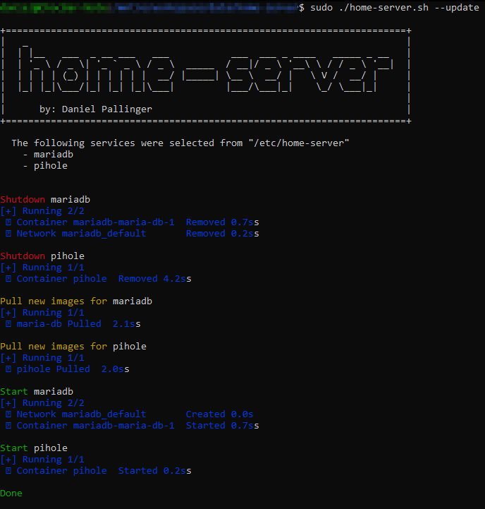

```
 _
| |__   ___  _ __ ___   ___           ___  ___ _ ____   _____ _ __
| '_ \ / _ \| '_ ` _ \ / _ \  _____  / __|/ _ \ '__\ \ / / _ \ '__|
| | | | (_) | | | | | |  __/ |_____| \__ \  __/ |   \ V /  __/ |
|_| |_|\___/|_| |_| |_|\___|         |___/\___|_|    \_/ \___|_|
    by: Daniel Pallinger
```

The purpose of this tool is to make the process of updating docker services
fast and easy. By using this tool you will be able to perform quick manual updates
or automate them by scheduling a cron job that executes the script in its update mode.

**Note:** By default, the script will search for services in the `/etc/home-server/` directory.
However, you can change the default directory by modifying the `BASE_PATH` variable in the script.

### File Structure

In order for the script to work the folder structure for your services must match
the pattern `BASE_PATH/*/docker-compose.yml`. You can chose any directory name
in place of the `*`.

This example illustrates how the file structure has to look like:
```
BASE_PATH
├── service-1
│   └── docker-compose.yml
├── service-2
│   └── docker-compose.yml
└── service-3
    └── docker-compose.yml
```

### Usage

```
NAME
       home-server.sh - Perform operations on services under "/etc/home-server"

OPTIONS
       --startup
          Start all services

       --update
          Update all services, by shutting them down, pulling the latest images
          that are defined in the compose files and restarting them.

       --shutdown
          Shutdown all services, removing containers, networks, volumes.

          By default, the operations are performed on all services. If you want to perform the
          operation only on certain services, then provide a whitespace separated list of services.
          (e.g. --<option> service-1 service-2 ... )
```

### Example Output




### Automatic Updates

By using the `crontab` tool it is easy to set up automatic updates.
Run `sudo crontab -e`, pick your favourite editor and then configure your updates like below.

```sh
# Edit this file to introduce tasks to be run by cron.
#
# Each task to run has to be defined through a single line
# indicating with different fields when the task will be run
# and what command to run for the task
#
# To define the time you can provide concrete values for
# minute (m), hour (h), day of month (dom), month (mon),
# and day of week (dow) or use '*' in these fields (for 'any').
#
# Notice that tasks will be started based on the cron's system
# daemon's notion of time and timezones.
#
# Output of the crontab jobs (including errors) is sent through
# email to the user the crontab file belongs to (unless redirected).
#
# For example, you can run a backup of all your user accounts
# at 5 a.m every week with:
# 0 5 * * 1 tar -zcf /var/backups/home.tgz /home/
#
# For more information see the manual pages of crontab(5) and cron(8)
#
# m h  dom mon dow   command

# docker service update at 3:00 every Sunday
0 3 * * 0 /etc/home-server/home-server.sh --update
```